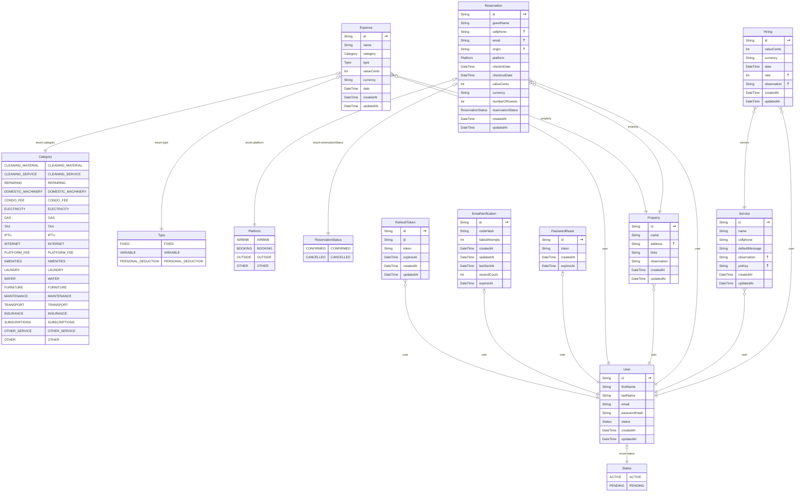

```mermaid
erDiagram

        Category {
            CLEANING_MATERIAL CLEANING_MATERIAL
CLEANING_SERVICE CLEANING_SERVICE
REPAIRING REPAIRING
DOMESTIC_MACHINERY DOMESTIC_MACHINERY
CONDO_FEE CONDO_FEE
ELECTRICITY ELECTRICITY
GAS GAS
TAX TAX
IPTU IPTU
INTERNET INTERNET
PLATFORM_FEE PLATFORM_FEE
AMENITIES AMENITIES
LAUNDRY LAUNDRY
WATER WATER
FURNITURE FURNITURE
MAINTENANCE MAINTENANCE
TRANSPORT TRANSPORT
INSURANCE INSURANCE
SUBSCRIPTIONS SUBSCRIPTIONS
OTHER_SERVICE OTHER_SERVICE
OTHER OTHER
        }
    


        Type {
            FIXED FIXED
VARIABLE VARIABLE
PERSONAL_DEDUCTION PERSONAL_DEDUCTION
        }
    


        Platform {
            AIRBNB AIRBNB
BOOKING BOOKING
OUTSIDE OUTSIDE
OTHER OTHER
        }
    


        ReservationStatus {
            CONFIRMED CONFIRMED
CANCELLED CANCELLED
        }
    


        Status {
            ACTIVE ACTIVE
PENDING PENDING
        }
    
  "RefreshToken" {
    String id "🗝️"
    String jti 
    String token 
    DateTime expiresAt 
    DateTime createdAt 
    DateTime updatedAt 
    }
  

  "EmailVerification" {
    String id "🗝️"
    String codeHash 
    Int failedAttempts 
    DateTime createdAt 
    DateTime updatedAt 
    DateTime lastSentAt 
    Int resendCount 
    DateTime expiresAt 
    }
  

  "PasswordReset" {
    String id "🗝️"
    String token 
    DateTime createdAt 
    DateTime expiresAt 
    }
  

  "Expense" {
    String id "🗝️"
    String name 
    Category category 
    Type type 
    Int valueCents 
    String currency 
    DateTime date 
    DateTime createdAt 
    DateTime updatedAt 
    }
  

  "Property" {
    String id "🗝️"
    String name 
    String address "❓"
    String links 
    String observation 
    DateTime createdAt 
    DateTime updatedAt 
    }
  

  "Reservation" {
    String id "🗝️"
    String guestName 
    String cellphone "❓"
    String email "❓"
    String origin "❓"
    Platform platform 
    DateTime checkinDate 
    DateTime checkoutDate 
    Int valueCents 
    String currency 
    Int numberOfGuests 
    ReservationStatus reservationStatus 
    DateTime createdAt 
    DateTime updatedAt 
    }
  

  "Service" {
    String id "🗝️"
    String name 
    String cellphone 
    String defaultMessage 
    String observation "❓"
    String pixKey "❓"
    DateTime createdAt 
    DateTime updatedAt 
    }
  

  "Hiring" {
    String id "🗝️"
    Int valueCents 
    String currency 
    DateTime date 
    Int rate "❓"
    String observation "❓"
    DateTime createdAt 
    DateTime updatedAt 
    }
  

  "User" {
    String id "🗝️"
    String firstName 
    String lastName 
    String email 
    String passwordHash 
    Status status 
    DateTime createdAt 
    DateTime updatedAt 
    }
  
    "RefreshToken" }o--|| "User" : "user"
    "EmailVerification" |o--|| "User" : "user"
    "PasswordReset" |o--|| "User" : "user"
    "Expense" |o--|| "Category" : "enum:category"
    "Expense" |o--|| "Type" : "enum:type"
    "Expense" }o--|| "Property" : "property"
    "Expense" }o--|| "User" : "user"
    "Property" }o--|| "User" : "user"
    "Reservation" |o--|| "Platform" : "enum:platform"
    "Reservation" |o--|| "ReservationStatus" : "enum:reservationStatus"
    "Reservation" }o--|| "User" : "user"
    "Reservation" }o--|| "Property" : "property"
    "Service" }o--|| "User" : "user"
    "Hiring" }o--|| "User" : "user"
    "Hiring" }o--|| "Service" : "service"
    "User" |o--|| "Status" : "enum:status"
```
